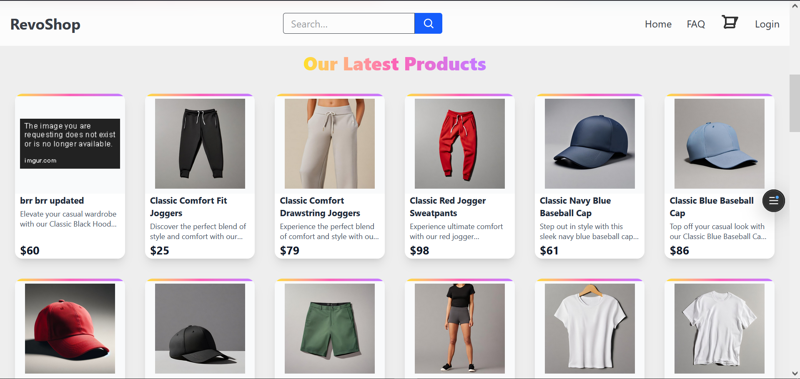
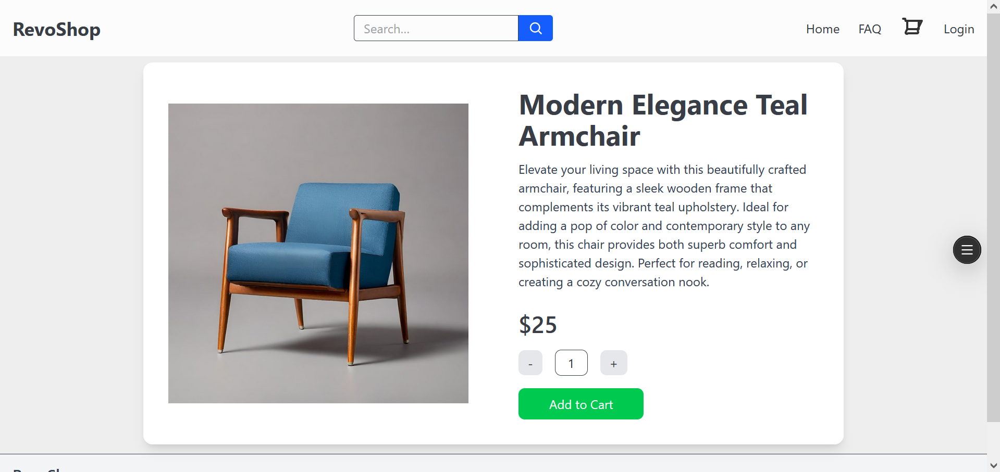
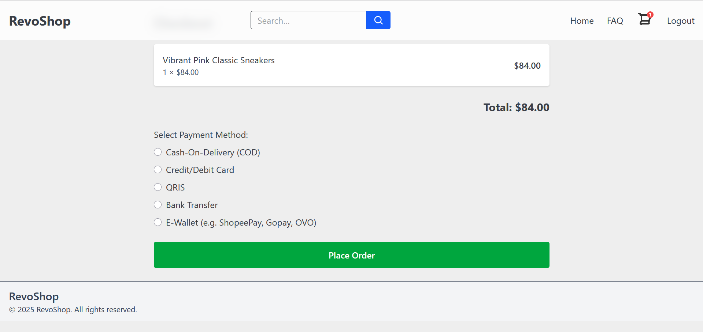
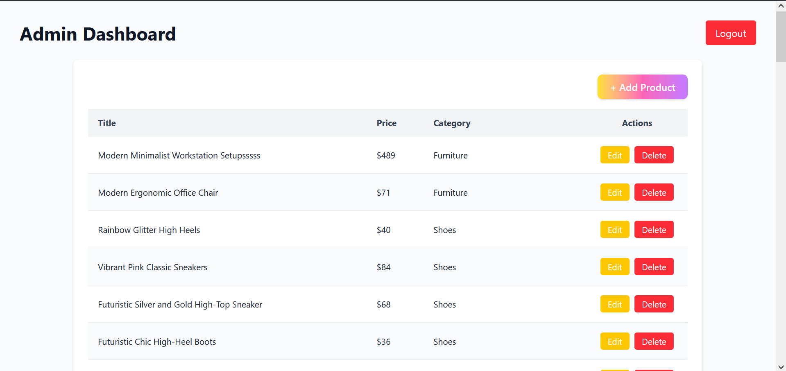

# RevoShop

## 📌 Overview

**RevoShop** is a full-stack e-commerce platform built with Next.js for a fictional company. It provides a seamless shopping experience for customers and efficient product management for administrators.

Key features include:

- Product browsing
- Shopping cart
- Checkout functionality
- User authentication
- Admin dashboard for CRUD operations

The app leverages modern web development practices such as dynamic routing, multiple data-fetching strategies (CSR, SSR, SSG, ISR), and unit testing for robustness and performance.

---

## 👇 Check Out Here

[RevoShop](https://milestone-3-muhammad-irfan-dzaky-mldj2259s.vercel.app/)

---

## ✨ Features Implemented

- **Product Browsing:** Fast, responsive product listing using Static Site Generation (SSG) and dynamic product detail pages with Server-Side Rendering (SSR). Seamless navigation with dynamic routing and `next/link`.
- **Data Fetching:** Combines SSG, SSR, and client-side fetching for optimal performance and real-time updates. Handles API errors and loading states for a smooth user experience.
- **Authentication:** Secure login with NextAuth.js, middleware to protect checkout routes, and user state management.
- **Shopping Cart:** Global state management with Context, cart persistence via `localStorage`, and a streamlined checkout process.
- **Admin Dashboard:** Full CRUD operations for products via API routes, with Incremental Static Regeneration (ISR) for up-to-date listings and form validation.
- **Testing & Optimization:** Unit tests with Jest and React Testing Library, performance enhancements through lazy loading and caching.

These features ensure a robust, modern e-commerce experience for both customers and administrators.

---

## 🛠 Technologies Used

- **Framework:** Next.js (SSR, SSG, ISR)
- **Authentication:** NextAuth.js
- **State Management:** Context
- **Data Fetching:** FakeStoreAPI
- **Testing:** Jest, React Testing Library
- **Styling:** Tailwind CSS
- **Deployment:** Vercel
- **Version Control:** Git, GitHub

---

## 💡 Getting Started

To run the project locally:

1. **Clone the repository:**
     ```bash
     git clone https://github.com/revou-fsse-feb25/milestone-3-MuhammadIrfanDzaky.git
     ```

2. **Change directory:**
     ```bash
     cd milestone-3-MuhammadIrfanDzaky
     ```

3. **Install dependencies:**
     ```bash
     npm install
     ```

4. **Run the development server:**
     ```bash
     npm run dev
     ```

5. **Open the application:**
     - Navigate to [http://localhost:3000](http://localhost:3000) in your browser.

6. **Customize:**
     - Modify content, images, and styles in the CSS and HTML files as needed.

---

## 📸 Screenshots

- **Home Page:** Grid of products fetched from FakeStoreAPI.
    

- **Product Detail Page:** Detailed product info with "Add to Cart".
    

- **Cart Page:** Cart summary with checkout option.
    

- **Admin Dashboard:** Manage products with CRUD operations.
    

---

## 👤 Author & Credits

- **Developer:** Muhammad Irfan Dzaky  
- **Email:** irfndzky@gmail.com  
- **GitHub:** [MuhammadIrfanDzaky](https://github.com/MuhammadIrfanDzaky)

Feel free to use and modify this project for personal or educational purposes. Contributions and feedback are welcome!

---